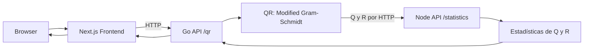

# Interseguro Coding Challenge

Monorepo con un frontend y dos APIs: recibe una matriz, calcula su factorización QR reducida y obtiene estadísticas de las matrices resultantes.

## Arquitectura



El navegador consume la Go API directamente. Go calcula `Q` y `R`, envía ambas matrices por HTTP a Node usando `NODE_API_URL` y construye la respuesta final con las estadísticas. Go es el punto principal de entrada para la operación QR.

## Estructura

```text
interseguro-challenge/
├── go-api/
│   ├── nodeclient/        # Cliente HTTP para Node API
│   ├── qr/                # QR y pruebas matemáticas
│   ├── Dockerfile
│   ├── main.go
│   └── main_test.go
├── node-api/
│   ├── src/
│   │   ├── statistics/    # Cálculo de estadísticas
│   │   ├── app.ts
│   │   └── index.ts
│   ├── test/
│   ├── Dockerfile
│   └── package.json
├── frontend/              # Next.js: interfaz QR, resultados y estadísticas
├── docker-compose.yml
└── README.md
```

## Tecnologías

- Go 1.22, Fiber v2 y `net/http` de la biblioteca estándar.
- Node.js, TypeScript, Express 5 y `tsx` para desarrollo.
- Node.js built-in test runner y `testing` de Go.
- Docker y Docker Compose.
- Next.js, React, TypeScript y CSS puro para el frontend responsive.

## Ejecución local

Docker Compose inicia las dos APIs:

```bash
docker compose up --build
```

Con la configuración actual, los servicios quedan disponibles en:

- Go API: `http://localhost:3001`
- Node API: `http://localhost:3002`

Para detenerlos:

```bash
docker compose down
```

El frontend se ejecuta de forma independiente en el puerto `3000` por defecto:

```bash
cd frontend
npm install
NEXT_PUBLIC_GO_API_URL=http://localhost:3001 npm run dev
```

También pueden ejecutarse las APIs individualmente. Primero inicie Node y después Go:

```bash
cd node-api
npm install
npm run dev
```

```bash
cd go-api
FRONTEND_URL=http://localhost:3000 \
NODE_API_URL=http://localhost:3002 \
go run .
```

## Variables de entorno

| Variable | Servicio | Uso | Valor local por defecto |
| --- | --- | --- | --- |
| `PORT` | Go y Node | Puerto de escucha asignado por el entorno cloud. | Go: `3001`; Node: `3002` |
| `NODE_API_URL` | Go | Base URL de Node API para `GET /health/dependencies` y `POST /qr`. | En Compose: `http://node-api:3002` |
| `FRONTEND_URL` | Go | Origen permitido por CORS para el navegador. | `http://localhost:3000` |
| `NEXT_PUBLIC_GO_API_URL` | Frontend | Base URL pública de Go API usada por el navegador para `POST /qr`. | `http://localhost:3001` |

`PORT` es opcional: Go usa `3001` cuando está vacío y Node usa `3002` cuando no recibe un puerto positivo válido. Para que `POST /qr` complete el flujo, `NODE_API_URL` debe estar configurada en Go.

Go configura CORS con `FRONTEND_URL`; para producción debe ser `https://interseguro-challenge.vercel.app`. No se utiliza un origen wildcard.

## Frontend

El frontend permite editar una matriz rectangular, agregar o eliminar filas y columnas, ejecutar la factorización, y visualizar `Q`, `R` y las cinco estadísticas recibidas. Incluye estados de carga, errores de API y diseño responsive. Los elementos Theory, History y API Docs del sidebar son visuales por ahora; no representan rutas o funcionalidades implementadas.

## Endpoints

### Go API

| Método | Ruta | Descripción |
| --- | --- | --- |
| `GET` | `/health` | Estado básico de Go API. |
| `GET` | `/health/dependencies` | Verifica por HTTP la disponibilidad de Node API. Endpoint operativo/de dependencias. |
| `POST` | `/qr` | Calcula QR, solicita estadísticas a Node y devuelve el resultado combinado. |

`GET /health` responde:

```json
{"status":"active"}
```

`GET /health/dependencies` responde, cuando Node está disponible:

```json
{
  "status": "active",
  "dependencies": {
    "node-api": "active"
  }
}
```

### Node API

| Método | Ruta | Descripción |
| --- | --- | --- |
| `GET` | `/health` | Estado básico de Node API. |
| `GET` | `/internal/health` | Health check interno que identifica el servicio. |
| `POST` | `/statistics` | Calcula estadísticas de las matrices `q` y `r`. Lo consume Go API. |

`GET /health` responde:

```json
{"status":"active"}
```

`GET /internal/health` es un endpoint interno y responde:

```json
{"status":"active","service":"node-api"}
```

`POST /statistics` recibe:

```json
{
  "q": [[1, 0], [0, 1]],
  "r": [[2, 3], [0, 4]]
}
```

y responde:

```json
{
  "max": 4,
  "min": 0,
  "sum": 11,
  "average": 1.375,
  "hasDiagonalMatrix": true
}
```

## Ejemplo completo: `POST /qr`

```bash
curl -X POST http://localhost:3001/qr \
  -H 'Content-Type: application/json' \
  -d '{
    "matrix": [
      [1, 1],
      [1, 0]
    ]
  }'
```

Respuesta representativa:

```json
{
  "q": [
    [0.7071067811865475, 0.7071067811865477],
    [0.7071067811865475, -0.7071067811865474]
  ],
  "r": [
    [1.4142135623730951, 0.7071067811865475],
    [0, 0.7071067811865476]
  ],
  "statistics": {
    "max": 1.4142135623730951,
    "min": -0.7071067811865474,
    "sum": 4.242640687119286,
    "average": 0.5303300858899107,
    "hasDiagonalMatrix": false
  }
}
```

Los últimos decimales pueden variar por aritmética de punto flotante.

## Factorización QR

Go implementa desde cero una factorización QR reducida mediante **Modified Gram-Schmidt**. Para cada columna, elimina las proyecciones sobre las columnas previas de `Q`; las proyecciones se almacenan en `R` y el residual normalizado forma la siguiente columna de `Q`.

La entrada debe ser una matriz rectangular `m × n` con `m >= n`, sin filas vacías, valores no finitos ni filas de distinto tamaño. La salida usa `Q` de dimensión `m × n` con columnas ortonormales y `R` de dimensión `n × n` triangular superior.

La tolerancia es `1e-12`, escalada por `max(1, norma original de la columna)`. Un residual con norma menor o igual a ese umbral se trata como columna linealmente dependiente o numéricamente casi dependiente.

## Estadísticas

Node valida `q` y `r` como matrices no vacías, rectangulares y con números finitos. Recorre todos los valores de ambas matrices en una sola pasada para calcular:

- `max`: mayor valor de `Q ∪ R`.
- `min`: menor valor de `Q ∪ R`.
- `sum`: suma de todos los valores de `Q` y `R`.
- `average`: `sum / cantidad total de valores`.

`hasDiagonalMatrix` es `true` si `Q` o `R` es cuadrada y todos sus valores fuera de la diagonal principal tienen valor absoluto menor o igual a `1e-12`. Una matriz no cuadrada nunca se considera diagonal.

## Manejo de errores

| Servicio/ruta | Estado | Caso |
| --- | --- | --- |
| Go `POST /qr` | `400` | JSON inválido, `matrix` ausente, matriz vacía/irregular, fila vacía, valores no finitos o `m < n`. |
| Go `POST /qr` | `422` | Columnas dependientes o casi dependientes según la tolerancia. |
| Go `POST /qr` | `503` | `NODE_API_URL` no configurada, Node no disponible o timeout. |
| Go `POST /qr` | `502` | Node devuelve un status no exitoso, JSON inválido o respuesta de estadísticas incompleta/no finita. |
| Go `GET /health/dependencies` | `503` | `NODE_API_URL` no configurada, Node no disponible, timeout o status no exitoso. |
| Node `POST /statistics` | `400` | JSON inválido, `q`/`r` ausente, matriz vacía/irregular, fila vacía o valores no finitos. |

## Tests

### Go API

```bash
cd go-api
go fmt ./...
go vet ./...
go test ./...
go build ./...
```

Las pruebas cubren QR 2×2 y rectangular, reconstrucción `Q × R`, ortonormalidad de `Q`, triangularidad de `R`, validaciones de matriz, cliente HTTP a Node, health de dependencias y los errores de integración de `POST /qr` con servidores `httptest`.

### Node API

```bash
cd node-api
npm install
npm test
npm run build
```

Las pruebas cubren health interno, cálculo y validación de estadísticas, detección de matrices diagonales y solicitudes HTTP válidas e inválidas a `/statistics`.

### Frontend

```bash
cd frontend
npm install
npm run build
```

El frontend no define un script de tests. El build de Next.js comprueba tipos y genera la aplicación de producción.

## Docker, despliegue y demo

Los dos servicios están contenerizados. La Go API utiliza una imagen multi-stage con `scratch` como imagen final, manteniendo una imagen mínima y los certificados CA necesarios para realizar conexiones HTTPS salientes.

Despliegue actual:

- Vercel — Frontend Next.js: <https://interseguro-challenge.vercel.app/>
- Render — Go API: <https://interseguro-go-api-d9s6.onrender.com>
- Render — Node API: <https://interseguro-node-api-lr3j.onrender.com>

### Prueba rápida

```bash
curl https://interseguro-go-api-d9s6.onrender.com/health
curl https://interseguro-node-api-lr3j.onrender.com/health
curl https://interseguro-go-api-d9s6.onrender.com/health/dependencies
curl -X POST https://interseguro-go-api-d9s6.onrender.com/qr \
  -H "Content-Type: application/json" \
  -d '{"matrix":[[1,1],[1,0]]}'
```

`/health/dependencies` permite comprobar que Go API puede comunicarse correctamente con Node API.

## Decisiones técnicas y supuestos

- El enunciado menciona «rotación» en algunos apartados, pero la funcionalidad requerida especifica factorización QR; esta implementación toma QR como el requisito concreto.
- Las estadísticas se calculan sobre todos los valores de `Q` y `R` juntos; la comprobación diagonal se realiza individualmente sobre cada matriz.
- Se implementa QR reducido para matrices rectangulares con `m >= n`; las columnas dependientes se rechazan en lugar de producir una base incompleta.
- El cliente HTTP Go → Node tiene un timeout de 30 segundos para tolerar cold starts de Node en la infraestructura gratuita de demostración.

## Funcionalidad opcional

- Frontend: implementado.
- JWT: no fue incluido; es una característica opcional del challenge.
